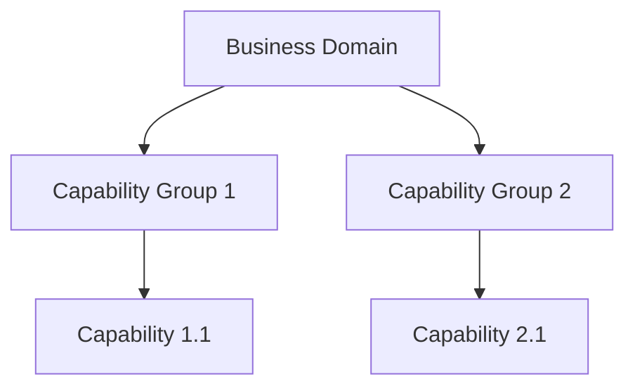
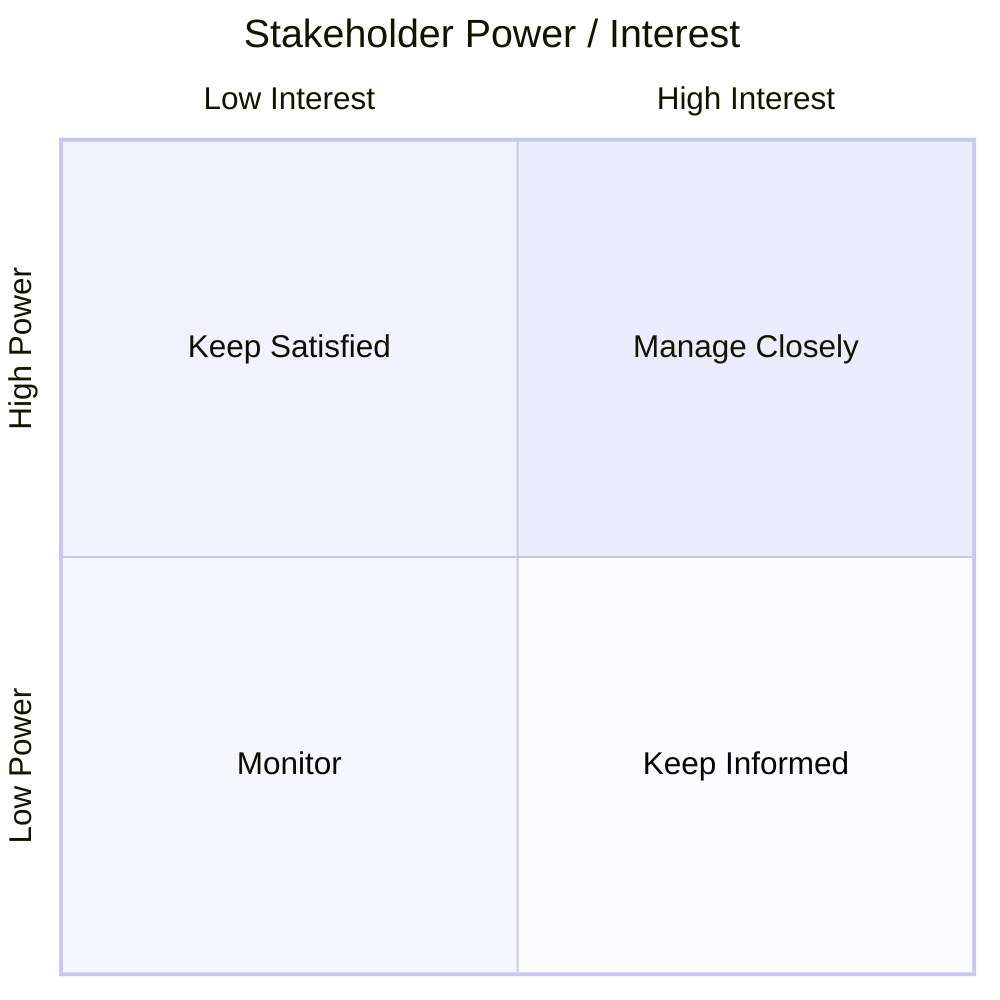
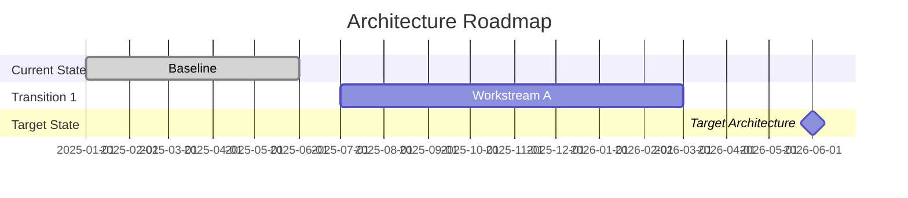
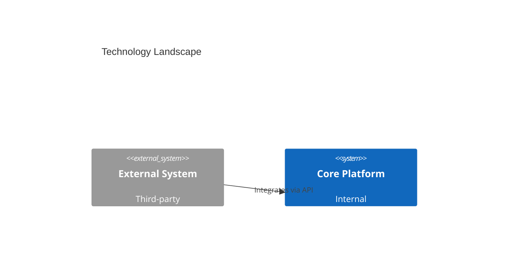

# TOGAF Artifacts

togaf-artifacts-skill handles all artifact generation and export across the ADM lifecycle. It supports five output formats — Mermaid (rendered live via the Mermaid Chart MCP tool), Markdown, Word (.docx), PowerPoint (.pptx), and consolidated EA documents — and maintains versioned artifact files so every iteration is preserved. Artifacts are organised by ADM phase and tracked in `project.json`; the publish workflow assembles all in-scope artifacts into a single EA document in phase sequence order.

## Artifact Types

| Type | Description | Default Format |
|------|-------------|----------------|
| Catalog | Structured list of architecture entities | Markdown table |
| Matrix | Relationship mapping between two domains | Markdown table |
| Diagram | Visual representation of architecture | Mermaid |
| Document | Formal architecture deliverable | Word (.docx) |
| Presentation | Stakeholder communication | PowerPoint (.pptx) |

## Full Artifact List by Phase

### Preliminary Phase

| Name | Type | Purpose | Default Format |
|------|------|---------|----------------|
| Organisational Model for EA | Document | Defines scope, roles, and responsibilities for the EA practice | Word (.docx) |
| Tailored Architecture Framework | Document | Customised TOGAF framework for the organisation | Word (.docx) |
| Architecture Principles | Catalog | Governing principles for all architecture decisions | Markdown table |
| Governance and Support Strategy | Document | How EA governance will be enacted | Word (.docx) |
| Initial Architecture Repository | Catalog | Seed repository structure and content | Markdown table |

### Phase A — Architecture Vision

| Name | Type | Purpose | Default Format |
|------|------|---------|----------------|
| Statement of Architecture Work | Document | Approved scope and approach for the architecture engagement | Word (.docx) |
| Architecture Vision Document | Document | High-level description of the target architecture and how it addresses stakeholder concerns | Word (.docx) |
| Stakeholder Map | Diagram + Matrix | Identifies stakeholders, their concerns, power, and engagement approach | Mermaid (quadrantChart) |
| Communications Plan | Document | How architecture information will be communicated to stakeholders | Word (.docx) |
| Capability Assessment | Catalog | Assessment of current organisational and architecture capabilities | Markdown table |
| Architecture Definition Document (high-level) | Document | Draft high-level architecture definition | Word (.docx) |

### Phase B — Business Architecture

| Name | Type | Purpose | Default Format |
|------|------|---------|----------------|
| Business Capability Map | Diagram | Hierarchical decomposition of business capabilities (L1–L3) | Mermaid (graph TD) |
| Process Flow Diagram | Diagram | Business processes and activities with swim lanes | Mermaid (flowchart LR) |
| Organisation Map | Diagram | Organisational structure and relationships | Mermaid (graph TD) |
| Business Interaction Matrix | Matrix | Relationships between business functions and organisational units | Markdown table |
| Business Gap Analysis | Matrix | Baseline vs. target business architecture gaps and dispositions | Markdown table |
| Architecture Definition Document (business) | Document | Business architecture sections of the definition document | Word (.docx) |
| Architecture Requirements Specification (business) | Catalog | Business architecture requirements | Markdown table |
| Business Architecture Roadmap Components | Diagram | Business workstreams on the architecture roadmap | Mermaid (gantt) |

### Phase C — Information Systems Architecture

| Name | Type | Purpose | Default Format |
|------|------|---------|----------------|
| Application Portfolio Catalog | Catalog | Inventory of all applications with owners, functions, platform, and lifecycle status | Markdown table |
| Data Entity Catalog | Catalog | Inventory of key data entities and their owners | Markdown table |
| Application Communication Diagram | Diagram | Application interactions and integration patterns | Mermaid (C4Context) |
| Data Flow Diagram | Diagram | How data moves between systems and processes | Mermaid (flowchart LR) |
| Application Interaction Matrix | Matrix | Application-to-application interaction mapping | Markdown table |
| Data Architecture Gap Analysis | Matrix | Baseline vs. target data architecture gaps | Markdown table |
| Application Architecture Gap Analysis | Matrix | Baseline vs. target application architecture gaps | Markdown table |
| Architecture Definition Document (IS) | Document | Data and application architecture sections | Word (.docx) |
| Architecture Requirements Specification (IS) | Catalog | Information systems architecture requirements | Markdown table |
| IS Architecture Roadmap Components | Diagram | IS workstreams on the architecture roadmap | Mermaid (gantt) |

### Phase D — Technology Architecture

| Name | Type | Purpose | Default Format |
|------|------|---------|----------------|
| Technology Landscape Diagram | Diagram | Technology components and their relationships (C4 model) | Mermaid (C4Context) |
| Technology Standards Catalog | Catalog | Approved technology standards and versions | Markdown table |
| Technology Portfolio Catalog | Catalog | Inventory of technology products in use | Markdown table |
| Technology Gap Analysis | Matrix | Baseline vs. target technology architecture gaps | Markdown table |
| Architecture Definition Document (technology) | Document | Technology architecture sections | Word (.docx) |
| Architecture Requirements Specification (technology) | Catalog | Technology architecture requirements | Markdown table |
| Technology Architecture Roadmap Components | Diagram | Technology workstreams on the architecture roadmap | Mermaid (gantt) |

### Phase E — Opportunities and Solutions

| Name | Type | Purpose | Default Format |
|------|------|---------|----------------|
| Architecture Roadmap (initial) | Diagram | Timeline of work packages migrating from baseline to target | Mermaid (gantt) |
| Implementation and Migration Strategy | Document | Approach for transitioning to the target architecture | Word (.docx) |
| Transition Architecture(s) | Document | Intermediate architecture states between baseline and target | Word (.docx) |
| Work Package Definitions | Catalog | Discrete implementation packages with scope, dependencies, and owners | Markdown table |
| Solution Building Blocks | Catalog | Reusable solution components identified during E | Markdown table |

### Phase F — Migration Planning

| Name | Type | Purpose | Default Format |
|------|------|---------|----------------|
| Implementation and Migration Plan | Document | Detailed schedule, resources, and sequencing for implementation | Word (.docx) |
| Architecture Roadmap (finalised) | Diagram | Finalised timeline with prioritised work packages | Mermaid (gantt) |
| Transition Architectures (updated) | Document | Refined intermediate states based on migration planning | Word (.docx) |
| Finalised Architecture Definition Document | Document | Complete, approved architecture definition | Word (.docx) |
| Finalised Architecture Requirements Specification | Catalog | Approved set of architecture requirements | Markdown table |

### Phase G — Implementation Governance

| Name | Type | Purpose | Default Format |
|------|------|---------|----------------|
| Architecture Contracts | Document | Signed agreements between development partners and sponsors | Word (.docx) |
| Compliance Assessments | Catalog | Assessments of project compliance with the architecture | Markdown table |
| Architecture Compliance Recommendations | Document | Recommendations arising from compliance reviews | Word (.docx) |

### Phase H — Architecture Change Management

| Name | Type | Purpose | Default Format |
|------|------|---------|----------------|
| Architecture Update Documents | Document | Revised architecture documents reflecting approved changes | Word (.docx) |
| Change Requests | Catalog | Formal requests for architecture change with impact assessment | Markdown table |
| New Statement of Architecture Work | Document | Triggers a new ADM cycle for significant changes | Word (.docx) |

### Requirements Management (all phases)

| Name | Type | Purpose | Default Format |
|------|------|---------|----------------|
| Requirements Register | Catalog | Central store of all architecture requirements across all phases | Markdown table |

## Generation Workflow

```
1. Identify artifact (phase + name)
2. Check project.json for existing versions
3. Collect required inputs (via ea-interview-techniques-skill if missing)
4. Choose output format (Mermaid / Word / PPTX)
5. Generate content
6. If Mermaid:
   a. Call the Mermaid Chart MCP tool (see Mermaid Diagram Workflow section for tool name resolution)
   b. This renders an inline widget with the diagram, Copy Code button, and repair link if invalid
   c. If invalid: fix syntax, retry (max 3 attempts)
   d. Ask user: "Does this diagram look correct?"
   e. On rejection: ask what to change, update, re-render
7. Save to artifacts/<phase>-<artifact-slug>-v<version>.<ext>
8. Update project.json: add version entry, set status/progress
```

## Mermaid Diagram Workflow

ALWAYS render every Mermaid diagram using the Mermaid Chart MCP tool. Never present a bare code block as the final output — the MCP tool renders a live interactive widget with a Copy Code button and a repair link when syntax is invalid.

**Tool name:** The tool is registered as `Mermaid Chart:validate_and_render_mermaid_diagram` in Claude.ai. In other environments it may appear as `mcp__mermaid_chart__validate_and_render_mermaid_diagram` or similar. Check available tools at the start of each session. Before the first diagram in a session, check available tools and use whichever name resolves. If neither resolves, fall back to a fenced Mermaid code block and note to the user: "Mermaid rendering is not available in this environment — the source below can be pasted into any Mermaid-compatible viewer (e.g. mermaid.live, VS Code, Obsidian)."

**Parameters:**
- `diagramCode` (required) — the full Mermaid source
- `title` (optional, but always provide it) — human-readable diagram title

**Render → confirm → save loop:**
1. Generate the Mermaid source
2. Call the MCP tool with `diagramCode` and `title`
3. If invalid: read the repair feedback, fix syntax, retry (max 3 attempts)
4. Ask: "Does this diagram look correct?"
5. On rejection: ask what to change, regenerate the source, call the MCP tool again
6. On approval: save the artifact file

**Artifact file format for Mermaid:**

```markdown
# <Artifact Name>
**Phase:** <phase> | **Version:** <version> | **Date:** <date>

## Diagram Source
```mermaid
<source>
```
```

Note: the rendered widget is shown live in the conversation — no image link is needed in the saved file.

## Mermaid Patterns

### Capability Map (graph TD)



### Stakeholder Map (quadrantChart)



### Architecture Roadmap (gantt)



### Technology Landscape (C4Context)



## New Version Workflow

When the user says "new version of `<artifact>`":

1. Read current version from `project.json`
2. Ask: "What has changed in this version?" (version notes)
3. Bump version: minor bump = 1.0 → 1.1 (content update); major bump = 1.0 → 2.0 (scope or structural change)
4. Generate updated content
5. If Mermaid: call `mcp__claude_ai_Mermaid_Chart__validate_and_render_mermaid_diagram`, confirm with user
6. Save as a new file — old file is preserved
7. Update `project.json`: set `currentVersion`, append to `versions[]`

**File naming:** `artifacts/<phase>-<slug>-v<version>.<ext>`

Examples:
- `artifacts/Prelim-architecture-principles-v1.0.md`
- `artifacts/Prelim-governance-model-v1.0.md`
- `artifacts/A-stakeholder-map-v1.1.md`
- `artifacts/B-capability-map-v2.0.md`
- `artifacts/D-technology-landscape-v1.0.md`

Note: Preliminary phase artifacts use `Prelim-` as the phase prefix. All other phases use their single letter (A, B, C, D, E, F, G, H).

## Format Selection Guide

| Artifact | Mermaid | Word (.docx) | PPTX |
|----------|---------|-------------|------|
| Architecture Vision | ✗ | ✓ primary | ✓ exec |
| Stakeholder Map | ✓ quadrant | ✓ matrix table | ✓ slide |
| Business Capability Map | ✓ graph TD | ✓ table | ✓ slide |
| Process Flow Diagram | ✓ flowchart | ✓ embedded | ✓ slide |
| Application Portfolio | ✗ | ✓ table | ✓ slide |
| Technology Landscape | ✓ C4 | ✓ embedded | ✓ slide |
| Gap Analysis | ✗ | ✓ table | ✓ slide |
| Architecture Roadmap | ✓ gantt | ✓ embedded | ✓ roadmap |
| Requirements Register | ✗ | ✓ table | ✗ |

## Consolidated EA Document (Publish)

Triggered by: "publish", "export EA document", "create EA report", or from ea-projects-skill.

### Publish Workflow

1. Ask: "Which format? `.md` or `.docx`"
2. Ask: "Any notes for this version?" (optional)
3. Determine next publication version by reading the `publications` array in `project.json`
4. Assemble content by iterating phases in sequence order:
   - Skip phases with `status = Skipped`
   - Include phases with `status = In Progress` or `Complete`
   - For each included phase: embed all artifacts with `status = In Progress` or `Complete` at their current version

**Mermaid diagrams in published documents:**
- For `.md` output: embed the Mermaid source code block (rendered by the viewer's Mermaid plugin). Do NOT call the MCP render tool during publish — the source block is the correct artifact format for documents.
- For `.docx` output: Mermaid diagrams cannot be rendered natively. Embed the Mermaid source as a preformatted code block with a caption: "Diagram: [artifact name] — view source in a Mermaid-compatible tool."
- Note to user in the confirmation message: "Mermaid diagrams are embedded as source code in the published document. Open the `.md` file in a Mermaid-enabled viewer (e.g. VS Code with Mermaid plugin, Obsidian) to see rendered diagrams."

5. Document structure:

```
# <Project Name> — Enterprise Architecture Document
**Organisation:** | **Version:** | **Date:** | **Status:**

## Progress Summary
Overall: <avg>%
| Phase | Status | Progress | Target Date |
|-------|--------|----------|-------------|
| Prelim | Complete | 100% | — |
| A | Complete | 100% | Mar 31 |
| B | In Progress | 45% | Jun 30 |

## Preliminary Phase
### Architecture Principles
### Governance Model

## Phase A — Architecture Vision
### Stakeholder Map
<artifact content or mermaid source>
### Architecture Vision Document
<content>

## Phase B — Business Architecture
...

## Appendix — Artifact Version History
| Phase | Artifact | Current Version | Previous Versions |
```

6. `.md`: write directly to `publications/<project-name>-ea-document-v<version>.md`
7. `.docx`: generate using `python-docx` (prerequisite: `pip3 install python-docx`); apply styling: Heading 1 dark blue `#1F3864`, body Calibri 11pt, orange `#C55A11` accents

   **Fallback if python-docx is unavailable:** If the `python-docx` library is not installed and cannot be installed, inform the user: "python-docx is not available in this environment. Falling back to `.md` format." Produce the `.md` version instead and name the file `publications/<project-name>-ea-document-v<version>.md`. Update `project.json` with `format: ".md"` regardless of what the user originally requested.

8. Save to `publications/<project-name>-ea-document-v<version>.<ext>`
9. Update `project.json` `publications` array with a progress snapshot
10. Confirm: "Published v\<version\> to `publications/<filename>`"

**Version bump:** minor (1.0 → 1.1) for content updates; major (1.0 → 2.0) when new phases are included.

## Export to Word / PowerPoint (Individual Artifacts)

**Prerequisites:** `pip3 install python-docx python-pptx`

**Fallback if python-docx is unavailable:** See fallback note in Publish Workflow above — same behaviour applies to individual artifact exports.

### Word (.docx) Structure

1. Cover Page — Title, Organisation, Date, Architect Name, Version
2. Table of Contents
3. Executive Summary
4. Content Sections (phase/artifact specific)
5. Appendices

### PowerPoint (.pptx) Structure

| Slide | Content |
|-------|---------|
| 1 | Title — document title, org, date, architect |
| 2 | Executive Summary — 3–5 bullet points |
| 3 | Architecture Overview — high-level diagram or capability map |
| 4–N | Phase / Topic Detail — one topic per slide |
| N+1 | Gap Analysis — table of key gaps |
| N+2 | Architecture Roadmap — gantt-style timeline |
| Last | Appendix / Next Steps |

### Styling Conventions

**Word:**
- Heading 1: 14pt bold, dark blue `#1F3864`
- Heading 2: 12pt bold, medium blue `#2E74B5`
- Body: Calibri 11pt
- Tables: dark blue header row with white text; alternating row shading

**PowerPoint:**
- Title slide: dark blue background `#1F3864`, white text
- Content slides: white background, dark blue headings
- Accent: orange `#C55A11` for highlights and callouts
- Font: Calibri throughout
- Bullets: simple dash, max 2 levels, max 6 per slide
